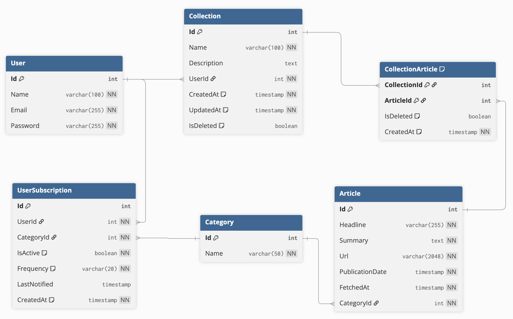

# NewsCollection Application

### Source code Organization (Clean Architecture)
.
├── NewsCollection.Api/             (Presentation)
│   └── Controllers/                 (API controller classes: ArticleController)
├── NewsCollection.Application/     (Business Logic)
│   ├── Dtos/                        (DTO: Data transfer between Client and API)
│   ├── Interfaces/                  (Interfaces, contract for Services and Repositories: IArticleService...)
│   └── Services/                    (Implement services for business logic, call repositories from Infra layer)
├── NewsCollection.Infrastructure/  (Infrastucture Layer: Database, External Services,...)
│   ├── Data/                        (DbContext, Migrations files)
│   ├── Repositories/                (Implement data access logic (CRUD) through DbContext)
│   └── Providers/                   (Infra services: TokenProvider - for JWT token generation... or Integrate with external services)
├── NewsCollection.Domain/          (Domain Layer: Business Entity, Core logic and Independ with other layers)
│   └── Entities/                    (entity classes: User, Article, Collection... define data structures and relationship of entities)
└── NewsCollection.sln

### DBML Schema

    

        
        <em>DBML Schema</em>
    

