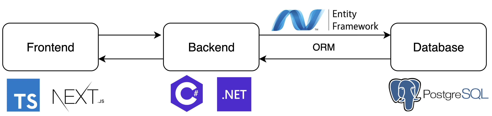

# NewsCollection Application

A modern news aggregation and collection application built with .NET 9.0 using Clean Architecture principles. This application allows users to browse, search, and organize news articles from various sources into personalized collections.

## Prerequisites

- [.NET 9.0 SDK](https://dotnet.microsoft.com/download)
- [PostgreSQL](https://www.postgresql.org/download/) (version 14 or higher)
- [Entity Framework Core CLI](https://docs.microsoft.com/en-us/ef/core/cli/dotnet) (`dotnet ef`)

## Technologies Used
- .NET 9.0
- Entity Framework Core 9.0
- PostgreSQL
- Hangfire (for background jobs)
- JWT Authentication
- Scalar.AspNetCore

## Setup Instructions

### 1. Clone the Repository

```bash
git clone https://github.com/dasabu/news-collection-clean-architecture.git
cd NewsCollectionCA
```

### 2. Setup

1. Create a PostgreSQL database for the application
2. Update the `appsettings.json` file in the `NewsCollection.Api` project

```json
{
  "ConnectionStrings": {
    "NewsCollectionDb": "Host=<host>;Port=<port>;Database=<database_name>;Username=<username>;Password=<password>"
  },
  "JwtSettings": {
    "Token": "<token>",
    "Issuer": "<issuer>",
    "Audience": "<audience></audience>"
  },
  "NewsApi": {
    "ApiKey": "<news_api_key>"
  },
  "SendGrid": {
    "ApiKey": "<sendgrid_api_key>",
    "SenderEmail": "<verified_sender_email>"
  }
}
```

### 3. Run Database Migrations

```bash
# Apply existing migrations
bash cmd/update-db.sh

# Create a new migration (if needed)
bash cmd/migrate-db.sh "MigrationName"
```

Note: 
- Make sure to stand at the root directory (`NewsCollectionCA`)
- Run the following commands before running the application

### 4. Build and Run the Application

```bash
bash cmd/run.sh
```

The API will be available at `https://localhost:5156` or `http://localhost:5155` by default.

## Architecture Overview

This project follows Clean Architecture principles with the following layers:

### Source Code Organization (Clean Architecture)

```
.
├── NewsCollection.Api/             (Presentation)
│   └── Controllers/                 (API controller classes: ArticleController)
├── NewsCollection.Application/     (Business Logic)
│   ├── Dtos/                        (DTO: Data transfer between Client and API)
│   ├── Interfaces/                  (Interfaces, contract for Services and Repositories: IArticleService...)
│   └── Services/                    (Implement services for business logic, call repositories from Infra layer)
├── NewsCollection.Infrastructure/  (Infrastucture Layer: Database, External Services,...)
│   ├── Data/                        (DbContext, Migrations files)
│   ├── Repositories/                (Implement data access logic (CRUD) through DbContext)
│   └── Providers/                   (Infra services: TokenProvider - for JWT token generation... or Integrate with external services)
├── NewsCollection.Domain/          (Domain Layer: Business Entity, Core logic and Independ with other layers)
│   └── Entities/                    (entity classes: User, Article, Collection... define data structures and relationship of entities)
└── NewsCollection.sln
```

### Application Architecture



### Backend Architecture


## DBML Schema


## Key Features

- User authentication and authorization with JWT
- News article aggregation from external APIs
- Article categorization and filtering by categories
- Personal collections for organizing articles
- Scheduled news synchronization using Hangfire
- User subscription to categories with frequency (daily/weekly)

## Known Limitations & Future Improvements

### Current Limitations

- Email notification features are not implemented
- Not deploy to production environment
- Not format return API in case data validation failed
- Not implement search functionality
- Only support basic filtering (by date, category)
- Limited news sources integration (depend on only NewsApi source)

### Planned Improvements

- Implement email notifications for new articles matching user preferences
- Format return API in case data validation failed
- Implement search functionality and advanced filtering
- Deploy website into production environment
- Expand news sources and integration options
- Add social sharing features